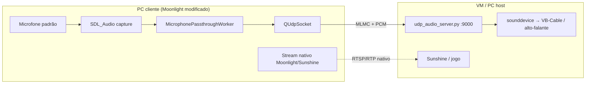

# Moonlight Qt — Microfone Side-Channel (UDP)

Fork do [Moonlight Qt](https://github.com/moonlight-stream/moonlight-qt) com envio paralelo do microfone local para o host via **UDP na porta 9000**, sem alterar o protocolo nativo de streaming (vídeo, áudio de retorno ou controle).

**Modificação desenvolvida por [Nanno](https://github.com/nanno).**

Base upstream: Moonlight Qt **6.1.0**.

---

## Visão geral



O áudio do microfone **não** entra no pipeline Opus/RTP do Moonlight. É um **side-channel**: conexão UDP independente, ativada apenas quando o usuário habilita a opção nas configurações e inicia uma sessão de streaming.

---

## Protocolo MLMC

Cada datagrama UDP contém um cabeçalho fixo de **16 bytes** (big-endian) seguido do payload PCM.

| Offset | Tamanho | Campo | Descrição |
|--------|---------|--------|-----------|
| 0 | 4 | `magic` | ASCII `MLMC` |
| 4 | 4 | `sequence` | Contador monotônico `uint32` BE (inicia em 1) |
| 8 | 2 | `sample_rate` | `uint16` BE (48000) |
| 10 | 2 | `channels` | `uint16` BE (1 = mono) |
| 12 | 2 | `bytes_per_sample` | `uint16` BE (2 = S16LE) |
| 14 | 2 | `payload_bytes` | `uint16` BE |
| 16 | N | `payload` | PCM **signed 16-bit little-endian**, mono |

**Parâmetros de áudio padrão**

- Sample rate: **48 000 Hz**
- Canais: **1** (mono)
- Frame: **480 amostras** (10 ms) → **960 bytes** de payload por pacote
- Porta UDP: **9000** (`MIC_PASSTHROUGH_PORT`)

Implementação de referência no cliente:

- `app/streaming/audio/microphonepassthrough.h`
- `app/streaming/audio/microphonepassthrough.cpp`
- Ativação em `app/streaming/session.cpp` (`MicrophonePassthroughManager`, padrão RAII após `LiStartConnection`)

---

## Cliente Moonlight (Windows)

### Pré-requisitos

- Windows 10/11
- [Visual Studio 2022 Build Tools](https://visualstudio.microsoft.com/downloads/) com **Desktop development with C++**
- Qt **6.7+** MSVC 64-bit (`C:\Qt\6.7.3\msvc2019_64` ou equivalente)
- Dependências nativas (via script abaixo)

### 1. Baixar dependências

Se o projeto foi extraído de ZIP (sem `.git`):

```powershell
powershell -ExecutionPolicy Bypass -File scripts\fetch-deps.ps1
```

### 2. Compilar (release, para distribuir)

```cmd
scripts\build-release-local.bat
```

Executável portátil (com runtimes MSVC embutidos):

```
build\deploy-x64-release\Moonlight.exe
```

Zippe a pasta **`build\deploy-x64-release`** inteira para usar em outro PC.

### 3. Ativar o microfone no cliente

1. Abra o Moonlight compilado
2. **Settings → Audio Settings**
3. Ative **"Send microphone to host via parallel UDP channel (port 9000)"**
4. Inicie um stream — o áudio é enviado para o IP ativo do host (`activeAddress`)

### Scripts de build úteis

| Script | Uso |
|--------|-----|
| `scripts\fetch-deps.ps1` | Clona dependências nos commits da v6.1.0 |
| `scripts\build-release-local.bat` | Build release + pacote portátil |
| `scripts\build-debug-local.bat` | Build debug (apenas desenvolvimento local) |
| `scripts\deploy-portable.bat release` | Reempacota `deploy-x64-release` |

---

## Receptor na VM / host (`scripts/`)

Arquivos para rodar na máquina que **recebe** o microfone (VM Windows com Sunshine, por exemplo):

| Arquivo | Função |
|---------|--------|
| `scripts/udp_audio_server.py` | Receptor MLMC → reprodução via `sounddevice` |
| `scripts/requirements-udp-audio.txt` | Dependências Python |
| `scripts/udp_audio_start.bat` | Inicia com console + log (`udp_audio_server.log`) |
| `scripts/udp_audio_start.vbs` | Inicia em segundo plano (`pythonw`, sem janela) |

### Instalação Python (VM)

```cmd
pip install -r scripts\requirements-udp-audio.txt
```

### Listar dispositivos de saída (VB-Cable, etc.)

```cmd
python scripts\udp_audio_server.py --list-devices
```

Anote o **índice** do dispositivo desejado e ajuste em `udp_audio_start.bat` / `udp_audio_start.vbs` (variável `DEVICE` / `deviceIndex`, padrão `16`).

### Execução manual

```cmd
cd scripts
python udp_audio_server.py --host 0.0.0.0 --port 9000 --device 16 --priming-ms 50
```

### Boot automático na VM (sem janela)

1. Copie a pasta `scripts/` para a VM (ex.: `C:\MoonlightUDP\`)
2. Ajuste o índice do dispositivo em `udp_audio_start.vbs`
3. Crie um atalho para `udp_audio_start.vbs` em:
   ```
   %APPDATA%\Microsoft\Windows\Start Menu\Programs\Startup
   ```
4. Logs em `scripts\udp_audio_server.log`

Para testar com janela visível, use `udp_audio_start.bat`.

### Firewall

Libere **UDP entrada na porta 9000** na VM/host.

---

## Créditos e licença

- **Moonlight Qt** — [moonlight-stream/moonlight-qt](https://github.com/moonlight-stream/moonlight-qt) (GPLv3)
- **Modificação de microfone side-channel (MLMC/UDP)** — **Nanno**

Este fork mantém a licença GPLv3 do projeto original. Consulte o arquivo `LICENSE` na raiz.

---

## Estrutura das alterações (cliente)

```
app/streaming/audio/microphonepassthrough.{h,cpp}   # Captura SDL + envio UDP
app/streaming/session.cpp                           # Inicialização RAII na sessão
app/settings/streamingpreferences.{h,cpp}           # Preferência persistente
app/gui/SettingsView.qml                            # Toggle na UI
app/app.pro                                         # Entradas de build
scripts/udp_audio_server.py                         # Receptor Python
scripts/udp_audio_start.{bat,vbs}                   # Autostart Windows
scripts/requirements-udp-audio.txt
scripts/fetch-deps.ps1
scripts/build-release-local.bat
scripts/deploy-portable.bat
```

O stream nativo de vídeo, áudio de retorno e controle **não é modificado**.
